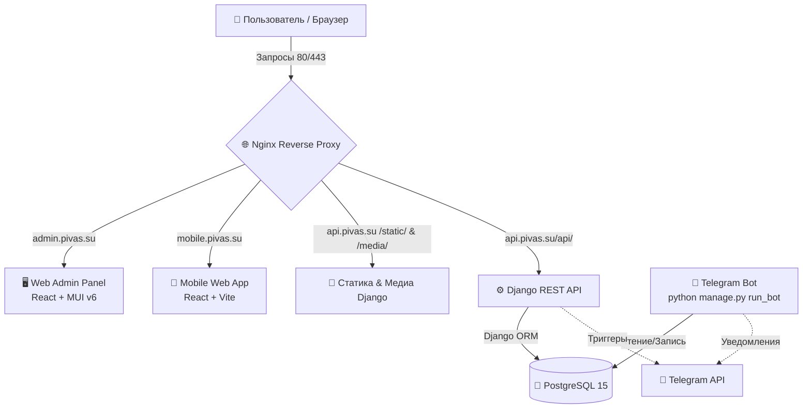

# 🎬 Биржа СМИ — Комплексная система управления медиацентром

[](https://www.djangoproject.com/)
[](https://react.dev/)
[](https://vitejs.dev/)
[](https://www.postgresql.org/)
[](https://nginx.org/)
[](https://core.telegram.org/bots)
[](https://www.docker.com/)

**Биржа СМИ** — это комплексная экосистема для автоматизации работы медиацентра (фотографов, видеографов, монтажеров, операторов дронов). Проект позволяет организаторам оперативно создавать заявки на съемку и бронировать необходимое оборудование из единого склада, а исполнителям (СМИ) — отслеживать, бронировать и брать задачи в работу через удобное мобильное веб-приложение.

---

## 🏛️ Архитектура системы

Система построена на базе сервисно-ориентированной архитектуры с единой точкой входа через Nginx (в production) и REST API для коммуникации между компонентами.

### Схема взаимодействия компонентов



---

## 🌟 Ключевые возможности

*   **👥 Ролевая модель и допуски:** 
    *   *Администраторы* имеют полный контроль над системой, складом техники и пользователями.
    *   *Организаторы* могут создавать мероприятия, описывать требования к съемке, бронировать технику и координировать команду.
    *   *Исполнители (СМИ)* видят доступные задачи в соответствии со своим профессиональным грейдом (например, PRO, VIDEO, DRONE) и принимают их в работу.
*   **📦 Интегрированный склад оборудования:** При назначении исполнителя на съемку за ним автоматически или вручную закрепляется необходимый комплект техники (камеры, объективы, петличные микрофоны, свет). Исключены пересечения и двойные бронирования одного и того же оборудования на одно время.
*   **💬 Event-чаты:** Каждая заявка снабжена локальным изолированным чатом для обсуждения технических деталей, таймингов и локаций прямо в интерфейсе приложения.
*   **🤖 Умный Telegram-бот:** Автоматически оповещает организаторов о статусе их заявок (когда задачу взяли в работу, когда прислали новое сообщение в чат мероприятия).
*   **⚙️ Динамические Feature Toggles:** Возможность гибко «на лету» отключать или подключать модули системы (чат, бронирование техники, жесткие дедлайны) через панель администратора без пересборки приложений.
*   **📊 Экспорт отчетов:** Генерация и выгрузка подробной статистики по проведенным съемкам и активности медиа-волонтеров в формат CSV.

---

## 📂 Структура репозитория

```bash
├── admin-web/          # Панель администратора (React, TypeScript, MUI v6)
├── backend/            # Бэкенд API и Telegram-бот (Django, DRF, PostgreSQL)
│   ├── core/           # Конфигурация Django (settings, urls, wsgi)
│   ├── events/         # Логика заявок, чатов, пользователей и Feature Toggles
│   └── manage.py       # CLI Django
├── mobile-web/         # Мобильное веб-приложение для исполнителей (React, Vite, TS)
├── nginx/              # Конфигурационные файлы Nginx и Dockerfile для production-сборки
├── docker-compose.yml  # Локальный Docker-compose (Development)
└── docker-compose.prod.yml # Боевой Docker-compose (Production)
```

---

## 🚀 Быстрый старт (Локальная разработка)

Все компоненты полностью контейнеризированы, что позволяет запустить проект одной командой.

### Шаг 1. Переменные окружения (`.env`)

Создайте файлы конфигурации на основе примеров. Для быстрого запуска в режиме разработки файлы `.env` уже преднастроены со стандартными значениями:

*   В папке `backend/` проверьте `backend/.env` (если планируете использовать Telegram-уведомления, укажите ваш `TELEGRAM_BOT_TOKEN`).
*   В папке `admin-web/` проверьте `admin-web/.env` (`REACT_APP_API_URL=http://localhost:8000/api`).
*   В папке `mobile-web/` проверьте `mobile-web/.env` (`VITE_API_URL=http://localhost:8000/api`).

### Шаг 2. Запуск контейнеров

В корневой директории проекта выполните команду сборки и запуска:
```bash
docker compose up -d --build
```

### Шаг 3. Миграции и создание Администратора

Миграции базы данных применяются автоматически при старте контейнера. Чтобы войти в панель управления, создайте суперпользователя Django:
```bash
docker compose exec backend python manage.py createsuperuser
```
Введите имя пользователя, email (опционально) и пароль.

### 📍 Локальные адреса сервисов:

*   **Панель администратора (React):** [http://localhost:3000/](http://localhost:3000/)
*   **Мобильное веб-приложение (Vite):** [http://localhost:5173/](http://localhost:5173/)
*   **Django Admin (Бэкенд панель):** [http://localhost:8000/admin/](http://localhost:8000/admin/)
*   **Интерактивная REST API документация:** [http://localhost:8000/api/](http://localhost:8000/api/)

---

## 🌐 Развертывание в Production

Для боевого сервера используется файл конфигурации `docker-compose.prod.yml`, обеспечивающий сборку фронтенд-приложений в статические файлы и их раздачу через оптимизированный Nginx с поддержкой SSL-сертификатов Let's Encrypt.

### Инструкция по деплою:

1.  **Настройка доменов и DNS:** 
    Направьте ваши поддомены (например, `admin.yourdomain.com`, `mobile.yourdomain.com`, `api.yourdomain.com`) на IP-адрес вашего VDS/VPS.
2.  **Генерация SSL-сертификатов:**
    Установите `certbot` на сервере и получите сертификаты:
    ```bash
    sudo certbot certonly --standalone -d admin.yourdomain.com -d mobile.yourdomain.com -d api.yourdomain.com
    ```
    По умолчанию Nginx в контейнере ожидает пути `/etc/letsencrypt/live/admin.pivas.su/` (см. `nginx/nginx.conf`). Вы можете заменить `admin.pivas.su` на свои домены в конфигурации Nginx перед сборкой.
3.  **Переменные окружения для Production:**
    Отредактируйте `.env` файлы. В `backend/.env` переведите `DEBUG=False` и укажите надежный `SECRET_KEY`, а также боевые реквизиты PostgreSQL.
4.  **Запуск production-окружения:**
    ```bash
    docker compose -f docker-compose.prod.yml up -d --build
    ```
5.  **Сбор статики Django:**
    Выполните сборку статических файлов бэкенда для их корректной раздачи через Nginx:
    ```bash
    docker compose -f docker-compose.prod.yml exec backend python manage.py collectstatic --noinput
    ```

---

## 🛠️ Полезные команды при администрировании

*   **Просмотр логов всех контейнеров:**
    ```bash
    docker compose logs -f
    ```
*   **Просмотр логов конкретного сервиса (например, Telegram-бота):**
    ```bash
    docker compose logs -f bot
    ```
*   **Принудительная остановка и очистка данных БД:**
    ```bash
    docker compose down -v
    ```
*   **Вход внутрь контейнера бэкенда для отладки (Django shell):**
    ```bash
    docker compose exec backend python manage.py shell
    ```

---

## 📄 Лицензия

Проект распространяется под лицензией **MIT**. Подробности в файле [LICENSE](LICENSE) (при наличии).
